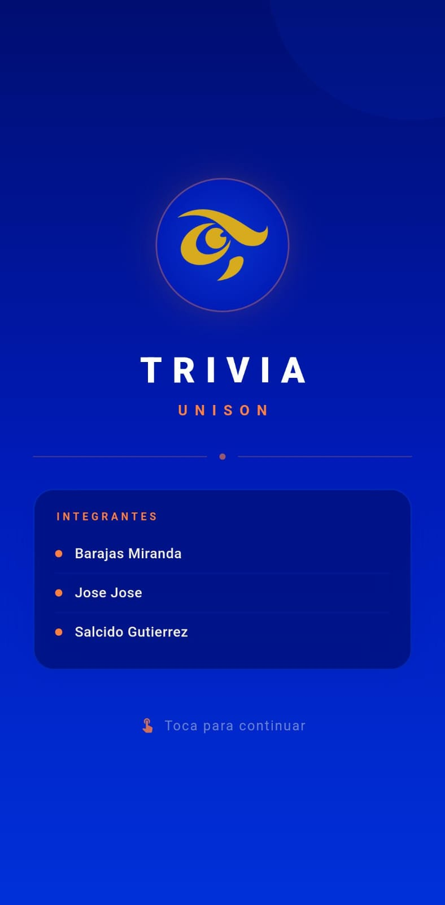
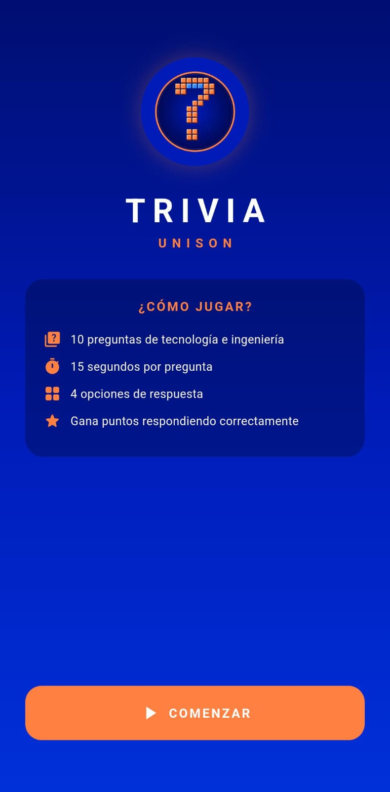
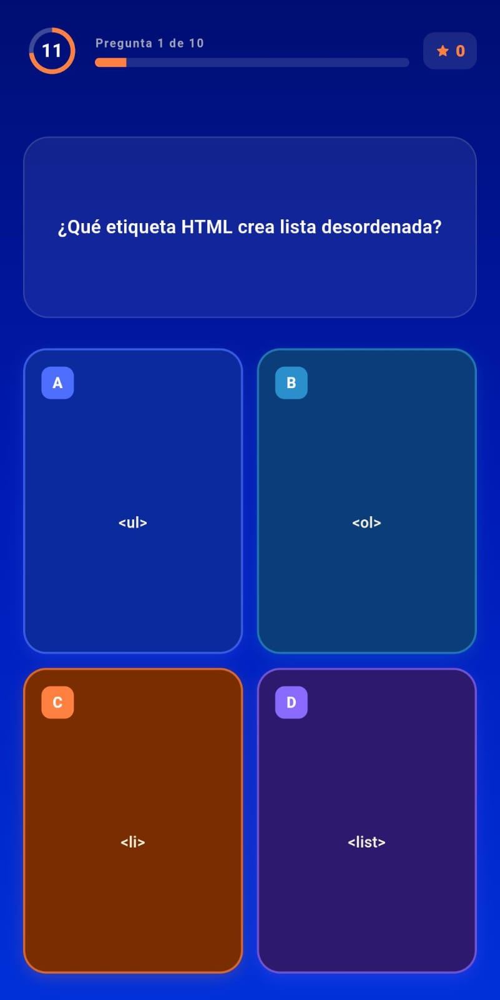
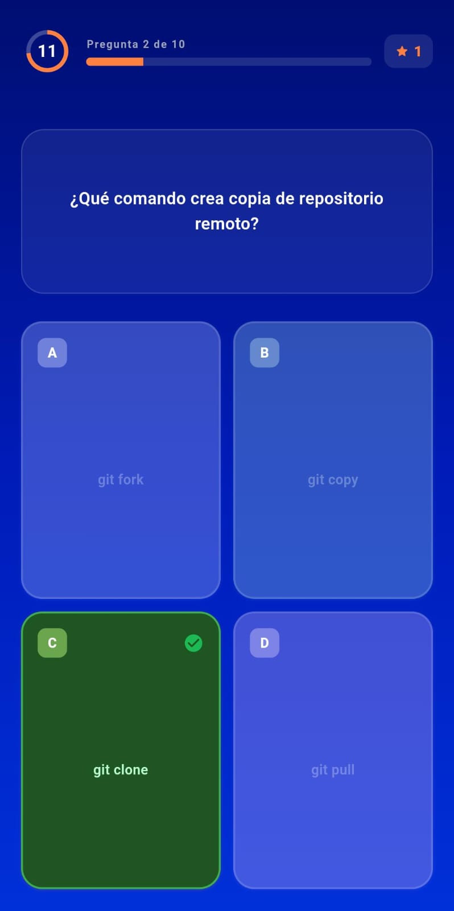
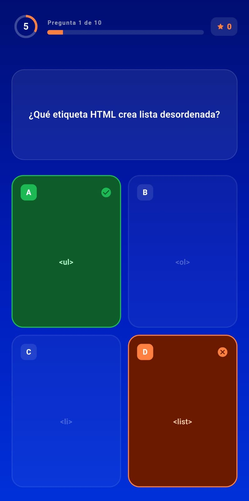
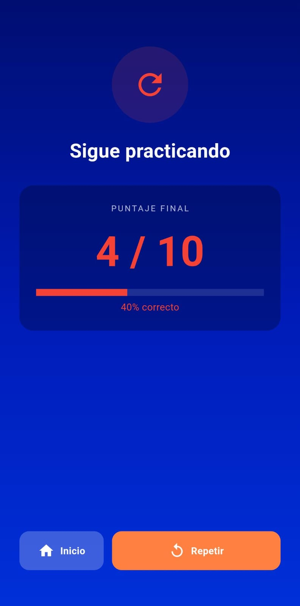

# Trivia UNISON 📱🧠

**Trivia UNISON** es una aplicación móvil desarrollada con **Flutter** que permite a los usuarios poner a prueba sus conocimientos mediante preguntas de opción múltiple relacionadas con **tecnología e ingeniería**.

La aplicación presenta preguntas tipo trivia donde el jugador debe seleccionar la respuesta correcta dentro de un tiempo limitado.

---

# 📷 Pantallas de la aplicación

## Pantalla de inicio

Al iniciar la aplicación se muestra la pantalla principal donde el usuario puede ver:

- El nombre de la aplicación **Trivia UNISON**
- Las instrucciones básicas del juego
- El botón **Comenzar** para iniciar la trivia.

En esta sección se explica cómo funciona el juego:

- La trivia contiene **10 preguntas**
- Cada pregunta tiene **15 segundos para responder**
- Cada pregunta tiene **4 opciones de respuesta**
- El usuario gana puntos por respuestas correctas.

---

## Pantalla de presentación

En esta pantalla se muestra la introducción de la aplicación junto con los **integrantes del equipo desarrollador**.

El usuario puede tocar la pantalla para continuar hacia la trivia.

---

## Preguntas de la trivia

Durante el juego se presenta una pregunta junto con **cuatro posibles respuestas** identificadas con letras.

El jugador debe seleccionar la opción que considere correcta antes de que termine el tiempo.

La interfaz también muestra:

- Número de pregunta actual
- Barra de progreso
- Tiempo restante
- Puntaje acumulado.

---

## Respuesta correcta

Cuando el usuario selecciona la respuesta correcta:

- La opción seleccionada se **resalta en color verde**
- Se muestra un **indicador de acierto**
- El jugador recibe **puntos**.

---

## Respuesta incorrecta

Si el usuario selecciona una respuesta incorrecta:

- La opción elegida se muestra en **color rojo**
- La respuesta correcta se marca en **verde**
- El juego continúa con la siguiente pregunta.

---

## Regresar al menú principal

Una vez terminado el juego el usuario podra visualizar lo siguiente.

- Su puntuación obtenida.
- Un botón para volver a jugar.
- Un botón para volver al menú principal

---

# ⚙️ Tecnologías utilizadas

- **Flutter**
- **Dart**

---

# 🎮 Funcionamiento del juego

1. El usuario inicia la aplicación.
2. Presiona **Comenzar**.
3. Se presentan **10 preguntas**.
4. Cada pregunta tiene **4 opciones de respuesta**.
5. El usuario tiene **15 segundos** para responder.
6. El sistema indica si la respuesta fue correcta o incorrecta.
7. Se acumulan puntos según las respuestas correctas.

---

# 👥 Integrantes

- Barajas Miranda Zihary Leticia 
- Jose Jose Alex Gabi
- Salcido Gutierrez Daniel Antonio
